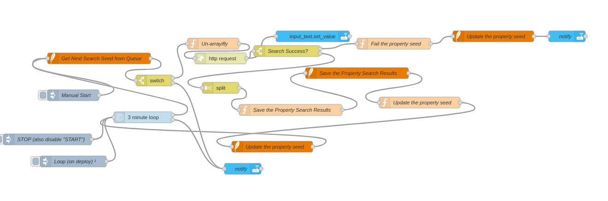
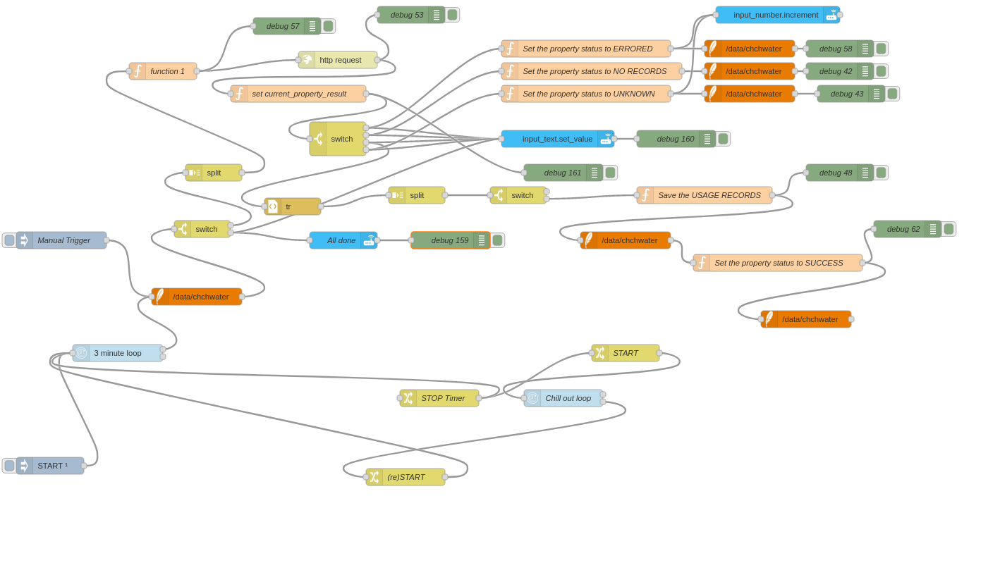

This project is a experiement in displaying a mobile friendly, representation of water usage in christchurch, its goal is to raise awareness for water conservation and the need for more broad understanding of how we consume our natural resources.
With over 170,000 addresses on the map, the app required a dyamic rendering system for higher zoom levels, which allowed for smooth scrolling, without compromissing on the detail display on the map.


Collection of the addresses was via a basic Node-Red automation, the site provides lookup based on id and list endpoint






```bash
npm run dev
# or
yarn dev
```